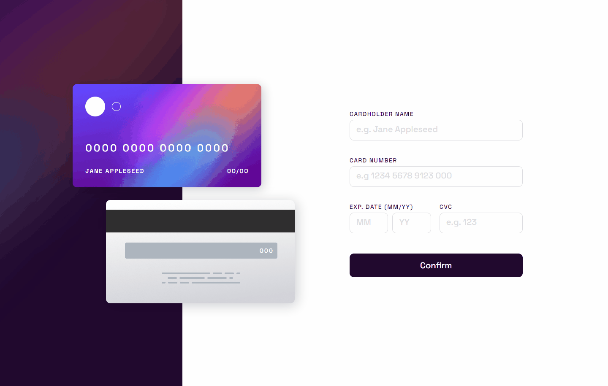
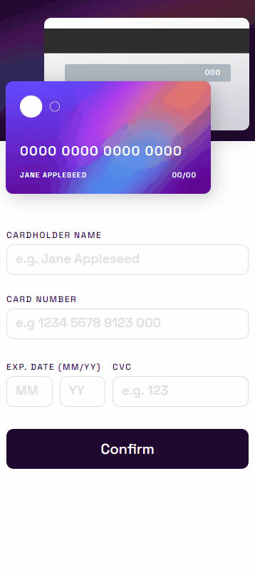

### <div align="center">Choose your language | Escolha seu idioma </div>

<div align="center">

[](https://github.com/edilan-ribeiro/fm-interactive-card/blob/main/README.en.md)
[](https://github.com/edilan-ribeiro/fm-interactive-card/blob/main/README.md) <br>


</div>
<br>
<a name="readme-top"></a>


<br />
<div align="center">
 <a href="https://github.com/edilan-ribeiro/fm-interactive-card">
    
  </a>

<h3 align="center">Interactive Card</h3>

  <p align="center">
   Frontend mentor challenge "Interactive Card"!
  </p>
  
  <a href="https://fm-interactive-card-sand.vercel.app/">View Demo</a>
</div>

<br>

<details>
  <summary>Table of Contents</summary>
  <ol>
    <li>
      <a href="#about-the-project">About The Project</a>
      <ul>
        <li><a href="#built-with">Built With</a></li>
        <li><a href="#highlights">highlights</a></li>
        <li><a href="#challenges-and-lessons-learned">Challenges and lessons learned</a></li>
      </ul>
    </li>
    <li><a href="#usage">Usage</a></li>
    <li><a href="#contact">Contact</a></li>
  </ol>
</details>

<br><br>

## About The Project

 

<br><br>

This project is about a page to fill in card data.

<br>


<br>



<p align="right">(<a href="#readme-top">back to top</a>)</p>


### Built With

<div align="center">


</div>


<p align="right">(<a href="#readme-top">back to top</a>)</p>


## Highlights

This page was based on the Frontend Mentor challenge and you can check out the challenge page <a href="https://www.frontendmentor.io/challenges/interactive-card-details-form-XpS8cKZDWw" target="_blank">here</a>.

The proposal is as follows:
- When the user fills out the form and sees the card details update in real time
- Display error messages when the form is submitted if:

  - Any input field is empty

  - The fields are in the wrong format

- Responsive layout
- Have active and focus states for interactive elements on the page

<p align="right">(<a href="#readme-top">back to top</a>)</p>

## Challenges and lessons learned

🚀 In this project, integrating with Next.js was engaging, exploring features like layout creation. Despite the project's modest size, it was an interesting experience..

💅 Styled Components: Its use was essential for the project's visual aspect, but integrating with Next.js posed challenges due to some incompatibilities with SSR and other internal functionalities. Overcoming these obstacles was possible with solutions like creating a registry, leveraging the flexibility and potential of Styled Components in the project.

💼 Forms: I used Zod and React Hook Form with TypeScript to enhance form handling and validation, providing a robust and user-friendly experience in the project.

In summary, it was possible to learn and practice:
 - Application of Styled Components in Next.js
 - Styled Components with TypeScript
 - Form validation with TypeScript
<p align="right">(<a href="#readme-top">back to top</a>)</p>

## Usage

After cloning, downloading, or forking, use the command below to install the project dependencies:
```shell
npm install
```

This project allows you to:
- Fill and send the form

<p align="right">(<a href="#readme-top">back to top</a>)</p>

## Contact

💌 To send me a message, just use one of the buttons below!<br>

  <a href = "mailto:edilanbusiness@gmail.com" target="_blank"></a>
  <a href="https://www.linkedin.com/in/edilan-ribeiro-santos" target="_blank"></a> 
  <a href="https://whatsa.me/5561983769634/?t=Hello,%20I%20came%20from%20your%20GitHub!" target="_blank">
  </a>


<p align="right">(<a href="#readme-top">back to top</a>)</p>
